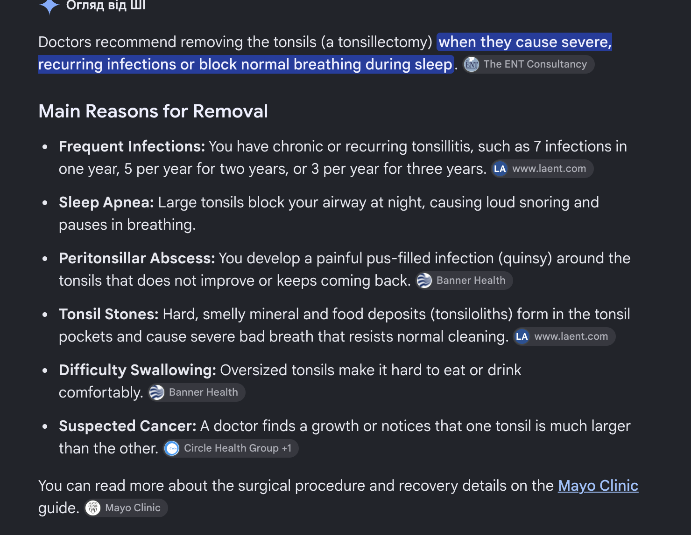

# Running the Todo application with MySQL

This project uses two Docker images:

- `mysql-local:1.0.0` for MySQL
- `todoapp:2.0.0` for the Django application

The application configuration in `todolist/settings.py` uses `my-mysql` as
the database host. Docker can resolve that name only when the application and
database containers are connected to the same user-defined network.

## 1. Build and publish the MySQL image

Build the image from `Dockerfile.mysql`:

```sh
docker build -f Dockerfile.mysql -t mysql-local:1.0.0 .
```

Log in to Docker Hub, tag the image with your Docker Hub username, and push
it. Replace `YOUR_DOCKERHUB_USERNAME` everywhere below.

```sh
docker login
docker tag mysql-local:1.0.0 boomax/mysql-local:1.0.0
docker push boomax/mysql-local:1.0.0
```
My MySQL Docker Hub repository: `https://hub.docker.com/r/boomax/mysql-local`

## 2. Create a Docker network and persistent volume

Create these once. The named volume keeps MySQL data when the `my-mysql`
container is removed and re-created.

```sh
docker network create todo-network
docker volume create mysql-data
```

If Docker says that either resource already exists, continue with the next
command.

## 3. Run MySQL with the volume attached

Start MySQL using the image built locally:

```sh
 docker run -d \
  --name mysql-local \
  mysql-local:1.0.0
```

Wait until the database reports that it is ready:

```sh
docker logs -f mysql-local
```

Press `Ctrl+C` after seeing a message such as `ready for connections`; this
only stops log streaming, not the MySQL container.

Verify the volume attachment:

```sh
docker inspect my-mysql --format '{{range .Mounts}}{{.Name}} -> {{.Destination}}{{println}}{{end}}'
```

Expected output includes `mysql-data -> /var/lib/mysql`.

## 4. Configure the application database connection

Keep the following MySQL settings in `todolist/settings.py`:

The task mentions using a container IP. A container name on a shared Docker
network is preferred because Docker DNS keeps working when the database
container is recreated. If an IP is specifically required, obtain it with:

```sh
docker inspect -f '{{range .NetworkSettings.Networks}}{{.IPAddress}}{{end}}' my-mysql
```

Then replace `HOST` with that returned IP.

```python
DATABASES = {
    'default': {
        'ENGINE': 'mysql.connector.django',
        'NAME': 'app_db',
        'USER': 'app_user',
        'PASSWORD': '1234',
        'HOST': '172.17.0.2',
        'PORT': '3306',
    }
}
```

Do this only after `my-mysql` is
running; the IP can change when the container is recreated.

## 5. Build the application image

Build the app image:

```sh
docker build -t todoapp:2.0.0 .
```

## 6. Run migrations and start the application

Run the Django container

```sh
docker run -d \
  --name todoapp \
  -p 8081:8080 \
  todoapp:2.0.0
```

Check that the application started successfully:

```sh
docker logs -f todoapp
```

## 7. Access the application

Open [http://localhost:8081/](http://localhost:8081/) in a browser. The API
is available at [http://localhost:8081/api/](http://localhost:8081/api/).

Take a terminal screenshot showing the successful application startup for the
task submission.



## 8. Publish the application image

Tag and push the application to Docker Hub:

```sh
docker tag todoapp:2.0.0 boomax/todoapp:2.0.0
docker push boomax/todoapp:2.0.0
```

Application image repository: `https://hub.docker.com/r/boomax/todoapp`

## Useful checks and cleanup

```sh
docker ps
docker volume ls
```

To stop and remove the containers while preserving the database data:

```sh
docker rm -f todoapp my-mysql
```

To remove the database data as well (irreversible):

```sh
docker volume rm mysql-data
